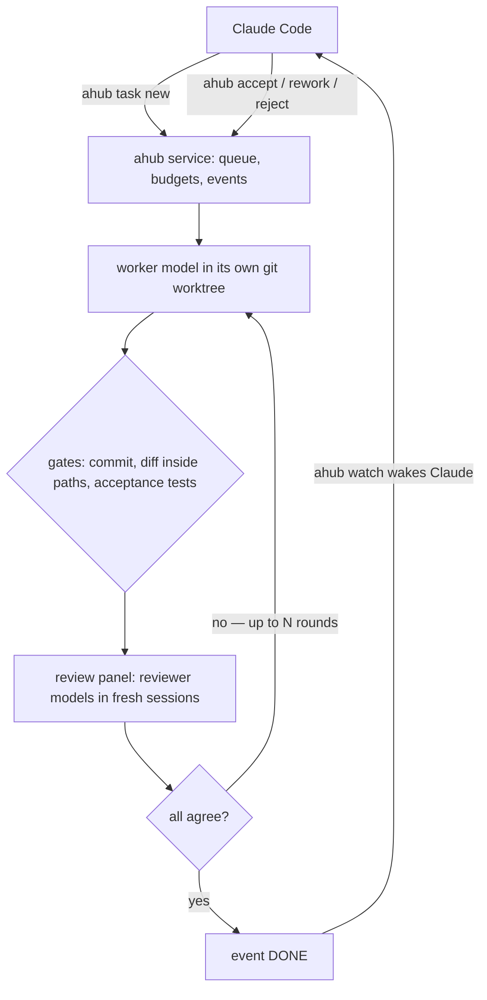

<p align="center"></p>

<p align="center"><a href="https://github.com/Takeh1ko/agent-hub/actions/workflows/ci.yml"></a> <a href="https://pypi.org/project/ahub/"></a>  </p>

<p align="center"><a href="https://github.com/Takeh1ko/agent-hub/blob/main/README.ru.md">Русская версия</a></p>

Let an orchestrator hand work to worker models and spend its own context only on decisions.

agent-hub is a local service that sits between an orchestrator (Claude Code, or any CLI agent over MCP) and worker
models. The orchestrator files a task and goes quiet. The hub runs the worker in its own git worktree, checks the
result — a commit, a diff inside the allowed files, the acceptance tests — sends it to reviewer models in fresh
sessions, retries failures, keeps the budgets, and wakes the orchestrator with one line when there is something to
decide: accept, send back with notes, or reject. Nothing else reaches the orchestrator's context unless it asks for
it: one event line, a summary capped at 4 KB, a one-word decision.

The short version of everything below is in the [user guide](docs/guide.md).

## How it works



The hub never merges on its own: the decision after `done` belongs to the orchestrator or to you. A network error is
retried, silence gets one continuation, a quota limit waits for its window (or the fallback model), a timeout /
budget limit turns into `needs_decision` — a task never
hangs silently. Events are stored until they are acknowledged, so a restarted session or a closed terminal does not
drop a "done".

<details>
<summary>See a task run</summary>


</details>

## Features

| | |
|---|---|
| Task kinds | `scout` (report only), `code` (branch + gates + review), `routine` (light changes), `review` (of a branch/commit/range/files) |
| Isolation | a git worktree per task, secrets hidden from the copy, clean environment for the worker |
| Gates | commit present, diff ⊆ allowed paths, structured result, acceptance tests under a shared lock |
| Review | panel of reviewer models in new sessions; disputes count only with file, line and reason; N rounds |
| Merge | `ahub accept` merges `--no-ff`, re-runs acceptance, rolls back if red |
| Failures | network error → retry; silence → one continuation; quota → waits for the window (or the fallback model); timeout/budget → `needs_decision`; never a silent hang |
| Budgets | per task (including review); at 100 % the worker is asked to save and stop, extension is one command |
| Providers | opencode, Google Antigravity (`agy`), OpenAI Codex CLI (`codex`); `ahub providers` shows what is found, logged in and enabled, `ahub providers enable\|disable <name>` switches one |
| Watching | `ahub status` — one line per task; `ahub status T12` — the task in detail; `ahub` opens the console, `ahub top` — the same console: current tasks, pulse, money and events in a terminal UI |
| Live transcript | `ahub follow T12` — the prompt, the worker's text, tool calls and results as they happen (`ahub log T12` stays raw) |
| Talking to a worker | `ahub nudge T12 "…"` — a message into the running session; the turn is interrupted and the same session continues |
| Waking Claude | `ahub watch` for Claude Code's Monitor, `ahub wait`; stable codes `DONE` `DECISION` `ERROR` `OWNER` `ANSWER` `ALARM` |
| Projects | one hub, several repositories; a Claude session sees only its project, the owner adds `--all`; `ahub projects`, `ahub cost`; Telegram routes messages per project |
| Pulse | 🟢 working · 🟡 waiting for a reason · 🔴 silent · ⚫ dead · ⚪ no data — from the provider, processes and locks |
| Observer | code checks every 5 min, a model review every 30 min, escalation to Claude, then to you |
| Human | `ahub top`; optional Telegram bot that talks to Claude (and starts Claude if no session is live) |
| Other agents | the same handles over MCP (`ahub mcp`) |
| Prompts | global, project, and local guidance per role on top of a lean built-in layer (`ahub prompts`) |
| Languages | English and Russian (`AHUB_LANG`, `lang` in config, or the locale) |

## Supported providers

| Provider | CLI | How you pay | Notes |
|---|---|---|---|
| [opencode](https://opencode.ai) | `opencode` | per token, or a plan (opencode Go); many models are free | the widest catalog; the hub takes the token counts and the cost from the session |
| Google Antigravity | `agy` | the quota of your Google account — no per-token money | Gemini models; a window quota rather than a budget |
| OpenAI Codex CLI | `@openai/codex` | your ChatGPT plan | the worker runs in the OS sandbox configured for codex |

The hub is not tied to any model. Any model a provider exposes can be added with `ahub models add` and given to a
role with `ahub models role`; `ahub setup` probes what you actually have and picks the defaults.

## What it costs

What follows is what work on this repository actually cost, at the tariffs it actually paid.

| Model | Tariff | Price per million tokens, input / output / cache read |
|---|---|---|
| Muse Spark 1.3 (reviewer, some workers) | opencode Go, contributor tier — a promotional rate | $0.10 / $0.20 / $0.002 |
| Space Bunny (worker) | opencode, a free model — promotional | $0 |
| Claude Opus 5.5 (for comparison only) | Anthropic API list price | $4 / $20 / $0.20 |

| Task | Worker | Review | Paid | Same tokens at Opus 5.5 prices* |
|---|---|---|---|---|
| `ahub doctor`: 13 checks with fix hints + tests | Spark 1.3 | Spark, 2 rounds | $0.094 | ≈ $6.31 |
| i18n catalog (EN/RU) + whole CLI translated | Spark 1.3 | Spark | $0.096 | ≈ $7.00 |
| `ahub setup` wizard (first version) | Spark 1.3 | Spark | $0.053 | ≈ $3.83 |
| New provider: Google Antigravity (`agy`) | Space Bunny (free) | Spark, 2 rounds | $0.018 | ≈ $5.05 |
| Per-provider proxy | Space Bunny (free) | Spark, 2 rounds | $0.026 | ≈ $6.53 |
| macOS CI: 6 failing tests fixed | Space Bunny (free) | Spark | $0.005 | ≈ $1.33 |

\* The Opus column is the same token count — the ones the hub recorded for every session of the task — priced at
Opus 5.5. Opus might finish the same work in fewer steps, so read it as an order of magnitude, not as a bill.

These are promotional rates (the opencode Go contributor tier, free models). They can change or end; free models can
also be rate-limited or disappear — the hub probes them (`ahub models check`) and falls back to another alias.

The roles are not tied to these models either: any cheap model works in the worker or the reviewer role. Examples
from the opencode Go catalog at the time of writing, per million tokens, input / output: MiMo v2.6 Flash $0.14 /
$0.28, DeepSeek v4.1 Flash $0.15 / $0.60; agy (a Google account quota) and codex (a ChatGPT plan) cost no per-token
money. `ahub setup` probes what you have and picks; `ahub models role` changes it later.

On any tariff the hub saves the orchestrator's context: Claude spends a few KB per task — one event line, a capped
summary, a one-word decision — instead of doing the work itself.

## How it compares

Several projects connect Claude Code to other agents. Most are thin bridges (start a session, poll its status).
agent-hub is narrower in scope and deeper in the task lifecycle:

| | agent-hub | thin MCP bridges (opencode-mcp, agent-delegation-mcp, agy bridges) | fleet orchestrators (claw-orchestrator, Composio agent-orchestrator) |
|---|---|---|---|
| Focus | Claude decides, cheap models work | pass a prompt, return output | many agents in parallel, dashboards, PR loops |
| Gates and acceptance tests before "done" | yes | no | partly |
| Review by other models | yes | no | yes |
| Orchestrator token budget as a design rule | yes (hard size limits) | no | no |
| Events survive restarts (ack) | yes | no | partly |
| Several repositories, isolated per project | yes | no | partly |
| Observer of the hub itself | yes | no | no |
| Web dashboard | no (terminal UI + Telegram) | no | yes |
| Number of supported agents | opencode, agy, codex | one | many |

If you want a dashboard for twenty parallel agents with PR automation, use a fleet orchestrator. If you want
Claude Code to stop burning its context on work a cheaper model can do — and to trust the result — this is it.

## Install

Requires Python 3.11+, git, and at least one provider: [opencode](https://opencode.ai) (free models work), Google
Antigravity CLI (`agy`) or Codex CLI (`@openai/codex`).

```
pipx install ahub
ahub setup                 # language, project, providers, models, service, Claude skill, Telegram (optional)
ahub doctor                # what is wrong and how to fix it
ahub providers             # the providers ahub knows: found, logged in, enabled, models
```

`ahub setup --yes` takes all defaults without questions. The wizard finds every provider, shows which are installed
and logged in and which are missing with an install hint, lets you switch each one on or off, and probes the models
live to pick the role defaults. Telegram is optional: `pipx install 'ahub[telegram]'`.

Platforms: Linux (systemd), macOS (launchd; tested in CI), Windows via WSL2 only.

Per-provider proxy and the Codex sandbox: [the guide](docs/guide.md#advanced-a-proxy-per-provider-the-codex-sandbox).

## Quick start for Claude Code

`ahub setup --claude` gives Claude Code everything it needs in one step: the `ahub` skill, a short block in the
project `CLAUDE.md` and the permission `Bash(ahub:*)` in `.claude/settings.json` — so `ahub …` runs without a
question every time (`ahub doctor` shows both).

```
ahub task new --kind code --title "add retry to the payment client" \
  --spec-file spec.md --paths "app/payments/**,tests/**" --accept "tests/test_payments.py"
```

Claude keeps a Monitor on `ahub watch`; when a line arrives it runs `ahub status T12` and decides:

```
DONE T12 code «add retry to the payment client» — report 2.1 KB; ready; $0.04
```

```
ahub accept T12                                # merge --no-ff, re-run acceptance
ahub rework T12 --notes "…"                    # send it back with notes, same session
ahub reject T12 --reason "…"                   # drop it, worktree cleaned up
```

Other agents talk to the same stdio server over MCP: `claude mcp add ahub -- ahub mcp`, and the same server in the
Codex or Cursor config.

## Interactive console

`ahub` with no arguments opens the console when stdin and stdout are TTYs (a pipe or `--json` keeps the
one-shot output byte-identical); `ahub top` opens the same console:

```
╭──────────────────────────────╮
│ ✻ ahub 3.0.0 · demo          │
│ project: demo · /srv/demo    │
│ service running (tick 3s ago)│
╰──────────────────────────────╯
⏺ ✢ T12  add retry to payments
  ⎿ writing code · spark · 2m 13s
◦ T13  queued · waiting for T12
⏺ T11  waiting for you
  ⎿ Next: ahub accept T11 …
> /accept T11
```

Stages read at a glance: `⏺` white + spinner — active (`writing code`, `studying`, `running tests`,
`in review`); `◦` dim — queued; `⏺` yellow — waiting for you; `✗` red — error/dead; `⏸` dim — stopped.
Every command calls the same functions as the CLI; `/help` lists them, `?` shows the shortcuts.

## Documentation

- [docs/guide.md](docs/guide.md) — user guide: install, providers, tasks, watching, costs, troubleshooting
- Developer docs, in English only:
  [docs/ARCHITECTURE.md](docs/ARCHITECTURE.md) (code map, start here),
  [docs/architecture.md](docs/architecture.md) (design),
  [docs/contracts.md](docs/contracts.md) (interfaces between the parts),
  [CONTRIBUTING.md](CONTRIBUTING.md)

## Development

```
python -m venv .venv && .venv/bin/pip install -e '.[dev]'
.venv/bin/python -m pytest -q          # ~6 min, no network, HOME is faked
AHUB_LIVE=1 .venv/bin/python -m pytest -m live   # real providers, costs money
```

## License

MIT
