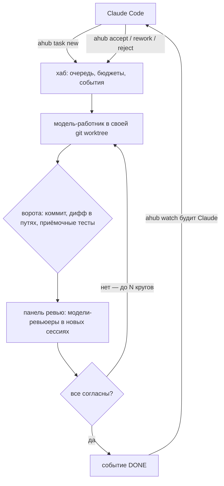

<p align="center"></p>

<p align="center"><a href="https://github.com/Takeh1ko/agent-hub/actions/workflows/ci.yml"></a> <a href="https://pypi.org/project/ahub/"></a>  </p>

<p align="center"><a href="https://github.com/Takeh1ko/agent-hub/blob/main/README.md">English version</a></p>

Пусть оркестратор отдаёт работу модельм-работникам, а свой контекст тратит только на решения.

agent-hub — локальный сервис между оркестратором (Claude Code или любым CLI-агентом по MCP) и моделями-работниками.
Оркестратор ставит задачу и замолкает. Хаб запускает работника в своей git worktree, проверяет результат — коммит,
дифф в разрешённых файлах, приёмочные тесты, — отдаёт его моделям-ревьюерам в новых сессиях, повторяет сбои, следит
за бюджетами и будит оркестратора одной строкой, когда нужно решение: принять, вернуть с замечаниями или
отклонить. Больше ничего в контекст оркестратора само не попадает: одна строка события, сводка не больше 4 КБ,
решение одним словом.

Короткая версия всего, что ниже, — в [руководстве пользователя](docs/guide.ru.md).

## Как это работает



Хаб никогда не сливает изменения сам: решение после `done` принадлежит оркестратору или вам. Обрыв сети —
повтор, тишина — одно продолжение, квота, таймаут или бюджет — `needs_decision`; задача не зависает молча. События
хранятся до подтверждения, поэтому перезапуск сессии или закрытый терминал не съедают «готово».

<details>
<summary>Как идёт задача</summary>


</details>

## Что умеет

| | |
|---|---|
| Типы задач | `scout` (только отчёт), `code` (ветка + ворота + ревью), `routine` (лёгкие правки), `review` (ветки, коммита, диапазона, файлов) |
| Изоляция | своя git worktree на задачу, секреты скрыты из копии, чистое окружение работника |
| Ворота | коммит есть, дифф ⊆ разрешённых путей, итог по форме, приёмочные тесты под общим замком |
| Ревью | панель моделей-ревьюеров в новых сессиях; спор засчитывается только с файлом, строкой и причиной; N кругов |
| Слияние | `ahub accept` сливает `--no-ff`, повторяет приёмку, откатывает при красной |
| Сбои | сеть → повтор; тишина → одно продолжение; квота/таймаут/бюджет → `needs_decision`; никаких тихих зависаний |
| Бюджеты | на всю задачу, включая ревью; на 100 % работника просят сохраниться и остановиться, продление — одна команда |
| Провайдеры | opencode, Google Antigravity (`agy`), OpenAI Codex CLI (`codex`); `ahub providers` показывает, кто найден, где есть вход и кто включён, `ahub providers enable\|disable <имя>` переключает |
| Наблюдение | `ahub status` — строка на задачу; `ahub status T12` — подробно о задаче; `ahub top` — текущие задачи, пульс, деньги и события в терминале |
| Живая расшифровка | `ahub follow T12` — промпт, текст работника, вызовы инструментов и результаты по ходу дела (`ahub log T12` остаётся сырым) |
| Разговор с работником | `ahub nudge T12 "…"` — сообщение в работающую сессию; текущий ход прерывается, та же сессия продолжается |
| Пробуждение Claude | `ahub watch` для Monitor в Claude Code, `ahub wait`; стабильные коды `DONE` `DECISION` `ERROR` `OWNER` `ANSWER` `ALARM` |
| Проекты | один хаб на несколько репозиториев; сессия Claude видит только свой проект, владелец добавляет `--all`; `ahub projects`, `ahub cost`; Telegram разводит сообщения по проектам |
| Пульс | 🟢 работает · 🟡 ждёт по делу · 🔴 молчит · ⚫ мёртв · ⚪ нет данных — по провайдеру, процессам и замкам |
| Наблюдатель | проверка кодом каждые 5 мин, моделью — каждые 30 мин, эскалация Claude, потом вам |
| Человек | `ahub top`; Telegram-бот по желанию — пишет Claude и поднимает Claude, если живой сессии нет |
| Другие агенты | те же ручки по MCP (`ahub mcp`) |
| Языки | английский и русский (`AHUB_LANG`, `lang` в конфиге или локаль) |

## Поддерживаемые провайдеры

| Провайдер | CLI | Как платите | Примечания |
|---|---|---|---|
| [opencode](https://opencode.ai) | `opencode` | за токены или по подписке (opencode Go); много моделей бесплатные | самый широкий каталог; хаб берёт токены и стоимость из сессии |
| Google Antigravity | `agy` | квота вашего аккаунта Google — без денег за токены | модели Gemini; это квота окна, а не бюджет |
| OpenAI Codex CLI | `@openai/codex` | подписка ChatGPT | работник работает в OS-песочнице, настроенной для codex |

Хаб не привязан ни к одной модели. Любую модель, которую отдаёт провайдер, можно добавить через `ahub models add` и
назначить ролью через `ahub models role`; `ahub setup` проверяет, что у вас есть, и подбирает умолчания.

## Сколько это стоит

Ниже — во сколько обошлась работа над этим репозиторием по тарифам, которые действительно действовали.

| Модель | Тариф | Цена за миллион токенов: вход / выход / чтение кэша |
|---|---|---|
| Muse Spark 1.3 (ревьюер, часть работников) | opencode Go, contributor tier — акционная ставка | $0.10 / $0.20 / $0.002 |
| Space Bunny (работник) | opencode, бесплатная модель — акционная | $0 |
| Claude Opus 5.5 (только для сравнения) | прайс-лист API Anthropic | $4 / $20 / $0.20 |

| Задача | Работник | Ревью | Заплачено | Те же токены по ценам Opus 5.5* |
|---|---|---|---|---|
| `ahub doctor`: 13 проверок с подсказками + тесты | Spark 1.3 | Spark, 2 круга | $0.094 | ≈ $6.31 |
| Каталог переводов (EN/RU) + перевод всего CLI | Spark 1.3 | Spark | $0.096 | ≈ $7.00 |
| Мастер `ahub setup` (первая версия) | Spark 1.3 | Spark | $0.053 | ≈ $3.83 |
| Новый провайдер: Google Antigravity (`agy`) | Space Bunny (бесплатно) | Spark, 2 круга | $0.018 | ≈ $5.05 |
| Прокси на каждого провайдера | Space Bunny (бесплатно) | Spark, 2 круга | $0.026 | ≈ $6.53 |
| CI на macOS: починены 6 падающих тестов | Space Bunny (бесплатно) | Spark | $0.005 | ≈ $1.33 |

\* Колонка Opus — тот же объём токенов, который хаб записал по каждой сессии задачи, посчитанный по ценам Opus 5.5.
Opus мог бы справиться за меньшее число шагов, поэтому это порядок величины, а не счёт.

Это акционные ставки (contributor tier в opencode Go, бесплатные модели). Они могут измениться или закончиться;
бесплатные модели к тому же могут ограничивать по частоте или исчезать — хаб проверяет их (`ahub models check`) и
переключается на другой псевдоним.

Роли тоже не привязаны к этим моделям: в работнике или ревьюере сойдёт любая дешёвая модель. Примеры из каталога
opencode Go на момент написания, за миллион токенов, вход / выход: MiMo v2.6 Flash $0.14 / $0.28, DeepSeek v4.1
Flash $0.15 / $0.60; agy (квота аккаунта Google) и codex (подписка ChatGPT) не стоят денег за токены. `ahub setup`
проверяет, что у вас есть, и подбирает; `ahub models role` меняет это позже.

На любом тарифе хаб бережёт контекст оркестратора: на задачу Claude тратит несколько КБ — одна строка события,
сводка с ограничением, решение одним словом, — вместо того чтобы делать работу сам.

## Чем отличается

Связать Claude Code с другими агентами пытаются многие. Большинство — тонкие мосты (запустить сессию, спросить
статус). agent-hub уже по охвату и глубже по жизненному циклу задачи:

| | agent-hub | тонкие MCP-мосты (opencode-mcp, agent-delegation-mcp, мосты к agy) | оркестраторы флота (claw-orchestrator, Composio agent-orchestrator) |
|---|---|---|---|
| Фокус | Claude решает, дешёвые модели работают | передать промпт, вернуть вывод | много агентов параллельно, панели, циклы PR |
| Ворота и приёмочные тесты до «готово» | да | нет | частично |
| Ревью другими моделями | да | нет | да |
| Бюджет токенов оркестратора как правило дизайна | да (жёсткие лимиты размера) | нет | нет |
| События переживают перезапуски (подтверждение) | да | нет | частично |
| Несколько репозиториев, изоляция по проектам | да | нет | частично |
| Наблюдатель за самим хабом | да | нет | нет |
| Веб-панель | нет (терминал + Telegram) | нет | да |
| Поддерживаемые агенты | opencode, agy, codex | один | много |

Нужна панель на двадцать параллельных агентов с автоматикой PR — берите оркестратор флота. Нужно, чтобы Claude Code
перестал жечь контекст на работу, которую сделает модель дешевле, и чтобы результату можно было верить, — это сюда.

## Установка

Нужны Python 3.11+, git и хотя бы один провайдер: [opencode](https://opencode.ai) (бесплатные модели подходят),
Google Antigravity CLI (`agy`) или Codex CLI (`@openai/codex`).

```
pipx install ahub
ahub setup                 # язык, проект, провайдеры, модели, служба, навык Claude, Telegram (по желанию)
ahub doctor                # что не так и как исправить
ahub providers             # провайдеры, которые знает ahub: найден, вход, включён, модели
```

`ahub setup --yes` — все умолчания без вопросов. Мастер находит всех провайдеров, показывает, кто установлен, где
есть вход, а кого нет — вместе с подсказкой по установке, включает каждого и живой проверкой моделей подбирает
модели для ролей. Telegram — по желанию: `pipx install 'ahub[telegram]'`.

Платформы: Linux (systemd), macOS (launchd; проверяется в CI), Windows — только через WSL2.

Прокси на каждого провайдера и песочница Codex — см. [руководство](docs/guide.ru.md#продвинуто-прокси-на-провайдера-песочница-codex).

## Быстрый старт с Claude Code

`ahub setup --claude` даёт Claude Code всё нужное за один шаг: навык `ahub`, короткий блок в `CLAUDE.md` проекта и
разрешение `Bash(ahub:*)` в `.claude/settings.json` — команда `ahub …` больше не спрашивает разрешения каждый раз (и
то и другое показывает `ahub doctor`).

```
ahub task new --kind code --title "добавить повтор в платёжный клиент" \
  --spec-file spec.md --paths "app/payments/**,tests/**" --accept "tests/test_payments.py"
```

Claude держит Monitor на `ahub watch`; пришла строка — он смотрит `ahub status T12` и решает:

```
DONE T12 code «добавить повтор в платёжный клиент» — отчёт 2.1 КБ; готов; $0.04
```

```
ahub accept T12                                # слить --no-ff, повторить приёмку
ahub rework T12 --notes "…"                    # вернуть с замечаниями, та же сессия
ahub reject T12 --reason "…"                   # отклонить, копия задачи удалится
```

Другие агенты говорят с тем же stdio-сервером по MCP: `claude mcp add ahub -- ahub mcp`, и тот же сервер `ahub mcp`
в конфиге Codex или Cursor.

## Документация

- [docs/guide.ru.md](docs/guide.ru.md) — руководство пользователя: установка, провайдеры, задачи, наблюдение, деньги,
  что делать, когда не работает
- Документация для разработчиков, только на английском:
  [docs/ARCHITECTURE.md](docs/ARCHITECTURE.md) (карта кода, начинать с неё),
  [docs/architecture.md](docs/architecture.md) (замысел),
  [docs/contracts.md](docs/contracts.md) (интерфейсы между частями),
  [CONTRIBUTING.md](CONTRIBUTING.md)

## Разработка

```
python -m venv .venv && .venv/bin/pip install -e '.[dev]'
.venv/bin/python -m pytest -q          # ~6 мин, без сети, HOME подменяется
AHUB_LIVE=1 .venv/bin/python -m pytest -m live   # настоящие провайдеры, тратит деньги
```

## Лицензия

MIT
